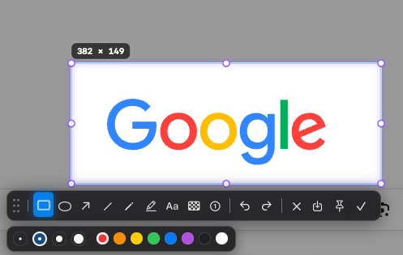
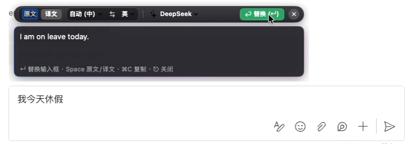

# SnipSnap

<p align="center">
  
</p>

<p align="center">
  <b>A lightweight, privacy-first native macOS utility. Seamlessly combines precision screenshots, vector annotations, scrolling capture, GIF recording, tactile pinning, on-device offline OCR, and in-place screen/input translation.</b>
</p>

<p align="center">
  <a href="https://github.com/iskf/SnipSnap/releases/latest"></a>
  <a href="#1-homebrew-cask-recommended"></a>
  <a href="https://apple.com"></a>
  <a href="https://swift.org"></a>
  
  <a href="LICENSE"></a>
</p>

<p align="center">
  <b>English</b> | <a href="README_zh.md">简体中文</a>
</p>

---

## Interface Overview

| Precision Capture & Grouped Toolbar | Secondary Palette & Vector Tools |
| :---: | :---: |
|  |  |
| **Hairline crosshair · Loupe color picker · Core actions** | **Geometric shapes · Step badges · Stroke & font sizing** |

| Safari-Style In-Place Screen Translation | Input Field Translation & Replacement |
| :---: | :---: |
|  |  |
| **On-device Vision OCR · Contextual overlay · Language pairs** | **Focus & translate · Enter to replace · Clipboard preservation** |

| Desktop Floating Pin | Native Preferences & Hotkeys |
| :---: | :---: |
|  |  |
| **Independent NSPanel · Stepless zoom/opacity · Text-to-card** | **Pure Swift/AppKit · Global hotkey recorder · Lightweight resident** |

---

## Key Features

### 1. 📸 Precision Screenshots & Vector Annotations
- **Pixel-Level Accuracy**: Hairline crosshair paired with an 8x live magnifying loupe displaying exact coordinates and HEX colors. Press `C` to copy the inspected color code.
- **Rich Annotation Arsenal**: Rectangles, ellipses, straight lines, smooth arrows, freehand brush, highlighter, text notes, pixelated mosaic/blur, and auto-incrementing step badges ① ② ③.
- **Undo & Redo**: Multi-step undo (`⌘Z`) and redo (`⇧⌘Z`), with one-click file saving or copying to the clipboard.

### 2. 📜 Scrolling Capture & Auto-Stitching
- **Continuous Downward Stitching**: Select any scrollable region (webpages, source code, long documents, or chat logs) and scroll down; SnipSnap automatically aligns overlapping frames into a seamless image.
- **Panoramic Live Preview**: A compact status capsule displays live height and frame count, expanding on hover to reveal a high-resolution panorama roll.

### 3. 🎞️ Region GIF Screen Recording
- **Box & Record**: Select any screen region and record directly to an optimized GIF at a rock-solid 15 FPS.
- **Flexible Controls**: Freely pause and resume during recording. Finished recordings are automatically copied to the clipboard and saved to disk.

### 4. 📌 Stepless Pinning & Text-to-Card
- **Always-on-Top Floating Pin**: Pinned images float across all virtual desktops, Spaces, and full-screen windows for persistent reference.
- **Intuitive Gestures**: Smooth zoom scaling (10%–800%) via trackpad pinch or scroll wheel, opacity adjustment (`1`–`9`), rotation (`R`), and flipping (`H`/`V`).
- **Mouse Click-Through**: Press `⌘L` to enable pass-through mode, turning the pin into a non-intrusive background reference.
- **Text & Code Cardification**: Copy text or code and press `F3`; SnipSnap formats and renders it into a sleek frosted code card pinned directly on your screen.

### 5. 🔍 On-Device Offline OCR & Selection Translation
- **100% Local Character Recognition**: Powered by the Apple Vision framework and Neural Engine; private texts and credentials never leave your Mac.
- **Safari-Style In-Situ Translation**: Recognized text is directly typeset and rendered over the original image. Tap `Space` to toggle between original and translated versions instantly.
- **Multi-Engine Support**: Seamlessly switch between Apple native offline translation, DeepL official API, and customizable AI engines (DeepSeek / OpenAI / Ollama).

### 6. ✍️ Input Field Translation & Replacement
- **Instant Input Translation**: Focus on any input field (or select a piece of text) and press the shortcut (default `⇧F4`) to bring up the translation capsule.
- **One-Key Overwrite**: Press `Enter` or click the green "Replace" button to overwrite the original text in the target application. Your original clipboard content is automatically restored afterward.

### 7. ⚡ Pure Native & Ultra-Lightweight
- **Swift & AppKit Architecture**: Built without heavy Electron or web wrappers. Cold-starts in milliseconds with near-zero idle memory footprint.
- **Menu Bar Resident & Global Hotkeys**: Runs quietly in the status bar. All action shortcuts are fully customizable via the native preferences panel.

---

## Shortcut Cheatsheet

| Shortcut | Action |
| :--- | :--- |
| `F1` / `⌥A` | Standard screenshot capture |
| `⌥F1` / `⌥S` | Scrolling capture mode |
| `⇧F1` / `F2` / `⌥O` | Selection OCR & in-place translation |
| `⇧F4` | Input field translation & replacement |
| `F3` / `⌥P` | Pin clipboard image / Convert text to card |
| `F4` | Quick clipboard translation |
| `C` | Copy HEX color under crosshair |
| `⌘L` | Toggle pin mouse pass-through (Lock mode) |
| `Space` | Toggle Original / Translated text in translation HUD |
| `Enter` | Confirm annotation / Execute translation replacement / Finish recording |
| `Esc` | Cancel and exit current action |

> *Note: All shortcuts can be customized in Preferences -> Shortcuts.*

---

## Installation

### 1. Homebrew Cask (Recommended)

```bash
brew install --cask iskf/snipsnap/snipsnap
```

To update in the future:
```bash
brew upgrade --cask snipsnap
```

### 2. Manual DMG Download

Download the latest `.dmg` release from [GitHub Releases](https://github.com/iskf/SnipSnap/releases/latest), open it, and drag `SnipSnap.app` into your `Applications` folder.

### 3. Build from Source

Requires macOS 14.0+ and Xcode 15+ command line tools:

```bash
git clone https://github.com/iskf/SnipSnap.git
cd SnipSnap
./build_app.sh
open build/SnipSnap.app
```

---

## Permissions & Privacy

- **Screen Recording**: Required by macOS to capture screen pixels, scrolling captures, and record GIFs.
- **Accessibility**: Required to listen to global hotkeys and to read/replace text in active input fields.
- **Zero Tracking**: SnipSnap contains zero analytics, telemetry, or tracking code. OCR and core translations run entirely on-device.

---

## License

This project is licensed under the [MIT License](LICENSE).
