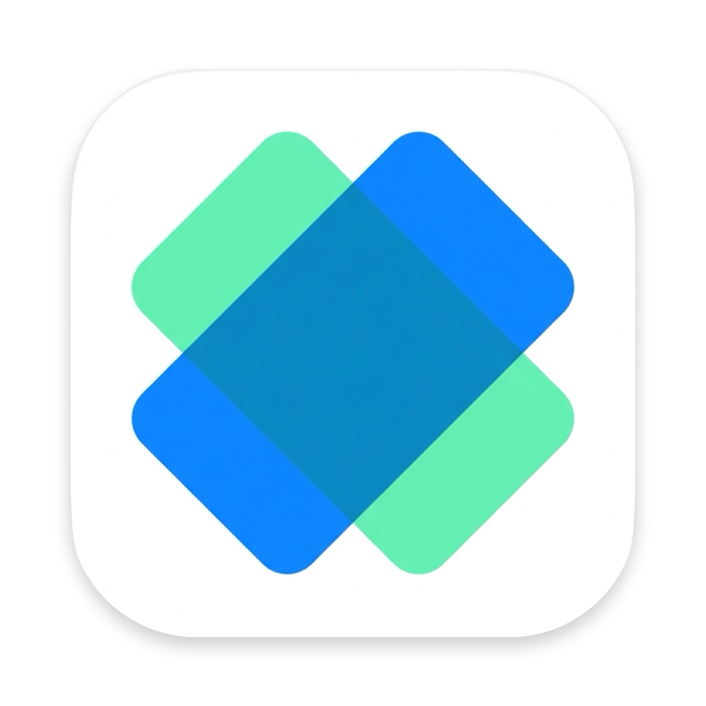
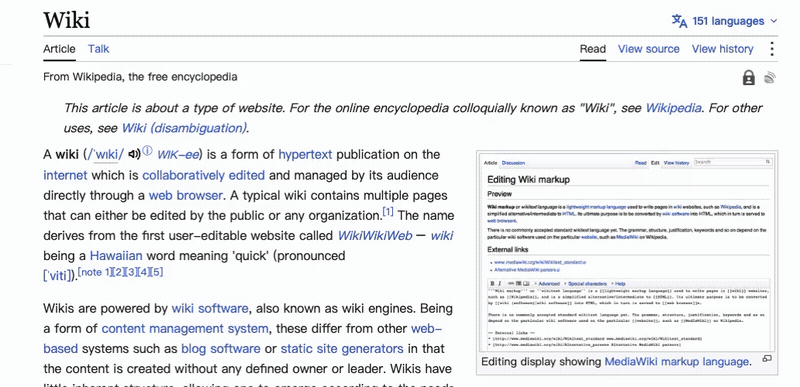
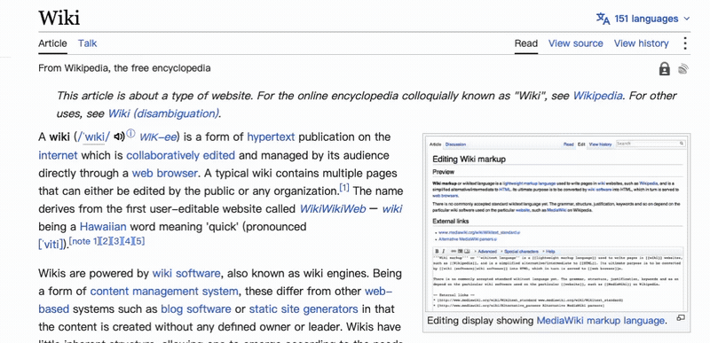
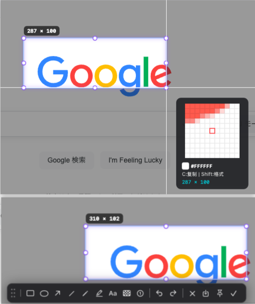
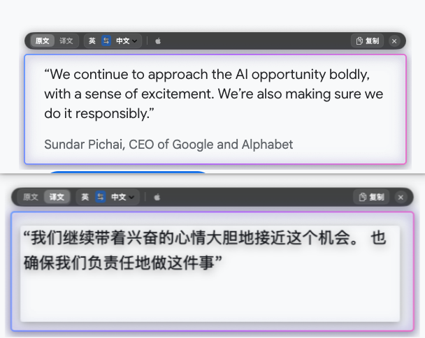
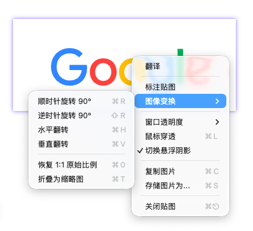
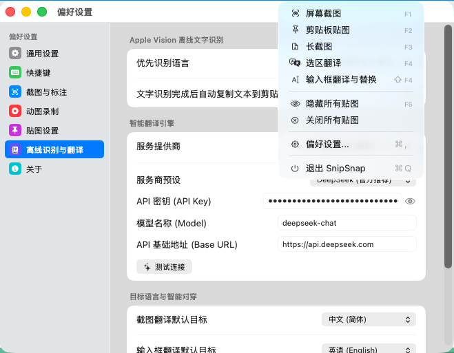

# SnipSnap

<p align="center">
  
</p>

<p align="center">
  <b>A lightweight, privacy-focused native macOS utility for precision screenshots, GIF screen recording, stepless pinning, on-device OCR, and in-place screen translation.</b>
</p>

<p align="center">
  <a href="https://github.com/iskf/SnipSnap/releases/latest"></a>
  <a href="#1-homebrew-cask-recommended"></a>
  <a href="https://apple.com"></a>
  <a href="https://swift.org"></a>
  
  <a href="LICENSE"></a>
  
</p>

<p align="center">
  <b>English</b> | <a href="README_zh.md">简体中文</a>
</p>

---

## Feature Previews

### Precision Capture & Tactile Pinning

<p align="center">
  <a href="docs/videos/capture_and_pin.mp4">
    
  </a>
</p>
<p align="center">
  <sub>Click preview above to view or download full HD MP4 (36s)</sub>
</p>

### Safari-Style In-Place Screen Translation

<p align="center">
  <a href="docs/videos/inplace_translation.mp4">
    
  </a>
</p>
<p align="center">
  <sub>Click preview above to view or download full HD MP4 (20s)</sub>
</p>

---

## Overview

**SnipSnap** is designed from the ground up for macOS using Apple native frameworks: **Swift, AppKit, SwiftUI, ScreenCaptureKit, Vision, and the Translation framework**.

Unlike heavy Electron-based screen utilities that consume hundreds of megabytes of memory, SnipSnap launches instantly, idles with near-zero resource utilization, and operates without mandatory cloud dependencies. It combines the tactile pinning workflow popularized by *Snipaste* with Apple Human Interface Guidelines, subtle illumination styling, and Safari-inspired in-place translation.

---

## Interface Previews

| Precision Capture & Grouped Toolbar | Safari-Style In-Place Screen Translation |
| :---: | :---: |
|  |  |
| **Pixel-level reticle · 8x loupe inspector · Divider-grouped toolbar** | **On-device Vision OCR · Contextual replacement · Zero-latency toggle** |

| Desktop Floating Pin & Context Menu | macOS Native Preferences Panel |
| :---: | :---: |
|  |  |
| **Independent NSPanel · Ambient glow · Comprehensive right-click actions** | **Swift/AppKit architecture · Global hotkey recorder · Menu bar resident** |

---

## Key Features

### 1. Pinning System
- **Independent Floating Window**: Pinned images float across all virtual desktops, Spaces, and full-screen windows for persistent reference during development and design.
- **Stepless Zoom**: Smooth scaling from **10% to 800%** using the mouse scroll wheel or trackpad pinch gestures.
- **Opacity Control**: Instant opacity adjustment using `Ctrl + Scroll` or direct number keys `1`–`9` (`0` restores 100% opacity).
- **Geometric Transformations**: Rotate clockwise in 90-degree steps (`R`), flip horizontally (`H`), or flip vertically (`V`) with automated viewport re-centering.
- **Mouse Pass-Through (Lock Mode)**: Toggle with `Command + L` or the context menu to let mouse events pass straight through to underlying applications.
- **Detached Annotation Toolbar**: Secondary annotations (shapes, arrows, mosaics, text) reside on an independent floating toolbar, eliminating canvas edge clipping.
- **Text-to-Card Conversion**: Press `F3` when code or text is copied; SnipSnap formats and renders it into a high-contrast code card pinned directly to the screen.

### 2. GIF Screen Recording  *(New in v1.1.0)*
- **Region-Selective Recording**: Select any screen region and record it directly to an optimized GIF animation, ready to paste or share.
- **Constant Frame Rate (CFR) Engine**: Rock-solid 15 FPS capture via `DispatchSourceTimer` ensures buttery-smooth playback with no fast-forwarding or frame drops.
- **ScreenCaptureKit Integration**: Uses Apple's modern `SCStream` API for hardware-accelerated, low-overhead screen capture with precise region cropping.
- **3-2-1 Countdown + Pre-Warming**: The capture stream is pre-warmed during the countdown so recording starts at t=0 with zero latency.
- **Pause / Resume**: Freely pause and resume recording. Paused intervals are cleanly excised from the final GIF.
- **Unified Toolbar Design**: The recording control bar matches the annotation toolbar's visual language — same dark glass background, rounded corners, dot-grid grip handle, and consistent icon style.
- **Auto-Sizing Toolbar**: The control bar dynamically resizes based on state (countdown, recording, paused, encoding, completed) with smooth right-anchored animations.
- **Invisible Overlays**: Border and control windows use `sharingType = .none` to ensure they are 100% invisible to the capture stream — no UI leakage in recordings.
- **Smart Export**: GIF is automatically copied to clipboard (as both `com.compuserve.gif` data and file URL) and optionally saved to a configured directory.
- **Configurable**: Frame rate (5–30 FPS), max duration (5–120s), cursor capture, Retina downsampling, auto-copy, auto-save, and sound feedback are all configurable in Preferences.

### 3. In-Place Screen Translation
- **In-Situ Text Replacement**: Selected screen text is recognized and replaced directly over the original visual context without external popups.
- **Native Segmented Switcher**: Instant switching between source text and translated results via mouse click or the `Space` key.
- **Language Pair Switcher**: Live dropdown supporting English, Simplified Chinese, Japanese, Korean, French, German, Spanish, and Russian, with single-click translation direction inversion (`<->`).
- **Multi-Tier Translation Engine**:
  1. **Apple Translation Framework**: On-device neural machine translation (macOS 15+ Sequoia).
  2. **DeepL Official API**: Optional user-provided API key for academic and professional translation accuracy.
  3. **High-Availability Fallback**: Automatic route failover ensuring uninterrupted service.
- **Non-Obtrusive Fallback**: If text recognition yields empty or low-confidence results, the original screenshot remains 100% visible and unblemished.

### 4. On-Device Offline OCR
- **Apple Vision Framework**: Text detection and optical character recognition run locally via the Apple Neural Engine and GPU.
- **Data Privacy**: Screen contents are processed entirely in-memory and never transmitted to external cloud endpoints.
- **Multilingual Recognition**: Accurate extraction across Latin, CJK (Chinese, Japanese, Korean), and mixed typographic symbols.
- **Typographic Line-Break Reconstruction**: Automatically connects soft-wrapped English words with single spaces while joining wrapped Chinese lines without superfluous gaps.

### 5. Vector Annotation Toolkit
- **High-Contrast Grouped Toolbar**: Organized into 3 discrete functional groups separated by vertical dividers:
  - **Drawing Tools**: Rectangle (`R`), Ellipse (`O`), Line (`L`), Arrow (`A`), Brush (`P`), Highlighter (`H`), Text (`T`), Mosaic (`M`), Numbered Steps (`N`).
  - **History**: Unlimited Undo (`Command + Z`) and Redo (`Shift + Command + Z`).
  - **Actions**: Cancel (`Esc`), Record GIF, Save File (`Command + S`), Pin (`F3`), Done and Copy (`Enter`).
- **Secondary Attribute Palette**: 8 curated color swatches and 3 stroke weight presets, seamlessly docked adjacent to the active tool.

### 6. Precision Loupe & Color Inspector
- **Real-Time 8x Magnifier**: Precise cursor tracking displaying an amplified pixel grid with a center target.
- **RGB and HEX Readout**: Live coordinate and hexadecimal color inspection under the reticle.
- **One-Key Copy**: Press `C` to copy the inspected color code directly to the system clipboard.

### 7. System Integration & Preferences
- **Standard Preferences Window**: Conforms to macOS design principles with a 160pt compact navigation column and SF Pro typography.
- **Carbon Hotkey Tap**: Low-latency global keyboard shortcuts operating reliably even across full-screen games or IDEs.
- **Accessory Run Mode**: Operates as a menu bar resident without cluttering the macOS Dock.

---

## Keyboard Shortcuts

### Capture & Annotation

| Shortcut | Action |
| :--- | :--- |
| `F1` / `Option + A` | Start screen capture |
| `F2` / `Option + O` | Area OCR and in-place translation |
| `F3` / `Option + P` | Pin image or convert clipboard text to card |
| `F4` | Quick translate clipboard text |
| `C` | Copy HEX color under cursor (Loupe mode) |
| `Command + Z` | Undo annotation |
| `Shift + Command + Z` | Redo annotation |
| `Command + S` | Save image to file |
| `Enter` | Complete annotation and copy to clipboard |
| `Esc` | Cancel / Dismiss current capture or tool |

### GIF Recording  *(New in v1.1.0)*

| Shortcut | Action |
| :--- | :--- |
| Toolbar 🔴 button | Start GIF recording from selected region |
| `Enter` | Finish recording and export GIF |
| `Esc` | Cancel recording |
| Pause ⏸ button | Pause / Resume recording |
| Drag grip handle | Reposition the recording control bar |

### Pinned Window

| Interaction | Action |
| :--- | :--- |
| **Scroll / Pinch** | Stepless zoom (10% to 800%) |
| `Ctrl + Scroll` / `1`–`9` | Adjust opacity (10% to 90%); `0` resets to 100% |
| `R` | Rotate 90 degrees clockwise |
| `H` | Flip horizontally |
| `V` | Flip vertically |
| `Command + L` | Toggle mouse pass-through (Lock mode) |
| **Double Click** | Dismiss pinned window |
| **Right Click** | Open context menu (Annotation, Transform, Resolution, etc.) |

### In-Place Translation HUD

| Interaction | Action |
| :--- | :--- |
| `Space` | Toggle between original and translated text |
| `Click [ <-> ]` | Swap source and target languages |
| `Target Language Menu` | Select target language |
| `Copy Button` | Copy translated text to clipboard |
| `Esc` / Click Outside | Close translation overlay |

---

## Architecture & Project Structure

```
SnipSnap/
├── Package.swift                          # Swift Package Manager manifest
├── build_app.sh                           # Application bundle build & signing script
├── Resources/
│   ├── AppIcon.icns                       # macOS application icon
│   └── Info.plist                         # Bundle properties & system permissions
└── Sources/
    └── SnipSnap/
        ├── App/                           # Lifecycle, NSApplicationDelegate, MenuBar
        ├── Capture/                       # Screen capture overlay, loupe, GIF recording
        ├── Annotation/                    # Canvas renderer, vector elements, toolbars
        ├── Pin/                           # Pinned NSPanel, external toolbar, cardifier
        ├── Translation/                   # In-place HUD, Apple Translation, DeepL
        ├── OCR/                           # Apple Vision framework offline OCR
        ├── Hotkeys/                       # Carbon & CGEventTap hotkey manager
        ├── Models/                        # App configuration, annotations, history
        └── Views/                         # Native SwiftUI preferences, loupe view
```

---

## Installation

### 1. Homebrew Cask (Recommended)

Install via the official tap with a single command:

```bash
brew install --cask iskf/snipsnap/snipsnap
```

Or add the tap first:

```bash
brew tap iskf/snipsnap
brew install --cask snipsnap
```

To update in the future:

```bash
brew upgrade --cask snipsnap
```

### 2. Manual Download (DMG)

1. Download the latest `SnipSnap-1.1.0.dmg` from [GitHub Releases](https://github.com/iskf/SnipSnap/releases/latest).
2. Open the DMG image and drag `SnipSnap.app` into your `/Applications` folder.
3. Launch SnipSnap from Launchpad or Spotlight.

### 3. Build from Source

#### Prerequisites
- macOS 14.0 (Sonoma) or macOS 15.0+ (Sequoia)
- Xcode 15.0+ or Command Line Tools (`xcode-select --install`)
- Swift 5.9+ toolchain

#### Build Steps
1. Clone the repository:
   ```bash
   git clone https://github.com/iskf/SnipSnap.git
   cd SnipSnap
   ```

2. Compile and package the application:
   ```bash
   ./build_app.sh
   ```

3. Launch the application:
   ```bash
   open build/SnipSnap.app
   ```

---

## Permissions & Privacy

SnipSnap is built with a strict local-first philosophy:
- **Screen Recording Permission**: Required by macOS to capture screen buffer pixels and for GIF recording. Requested on first launch or accessible via `System Settings -> Privacy & Security -> Screen & System Audio Recording`.
- **Accessibility Permission**: Required for intercepting global hotkeys (`F1`–`F4`) system-wide. Accessible via `System Settings -> Privacy & Security -> Accessibility`.
- **Zero Telemetry**: SnipSnap collects no metrics, transmits no tracking telemetry, and makes no network requests unless you explicitly activate third-party translation services like DeepL.

---

## Contributing

Contributions, issues, and feature requests are welcome. Please refer to [CONTRIBUTING.md](CONTRIBUTING.md) for architecture guidelines, code conventions, and pull request workflows.

---

## License

This project is licensed under the [MIT License](LICENSE).

<p align="center">
  <sub>Designed for macOS power users, developers, and designers.</sub>
</p>
